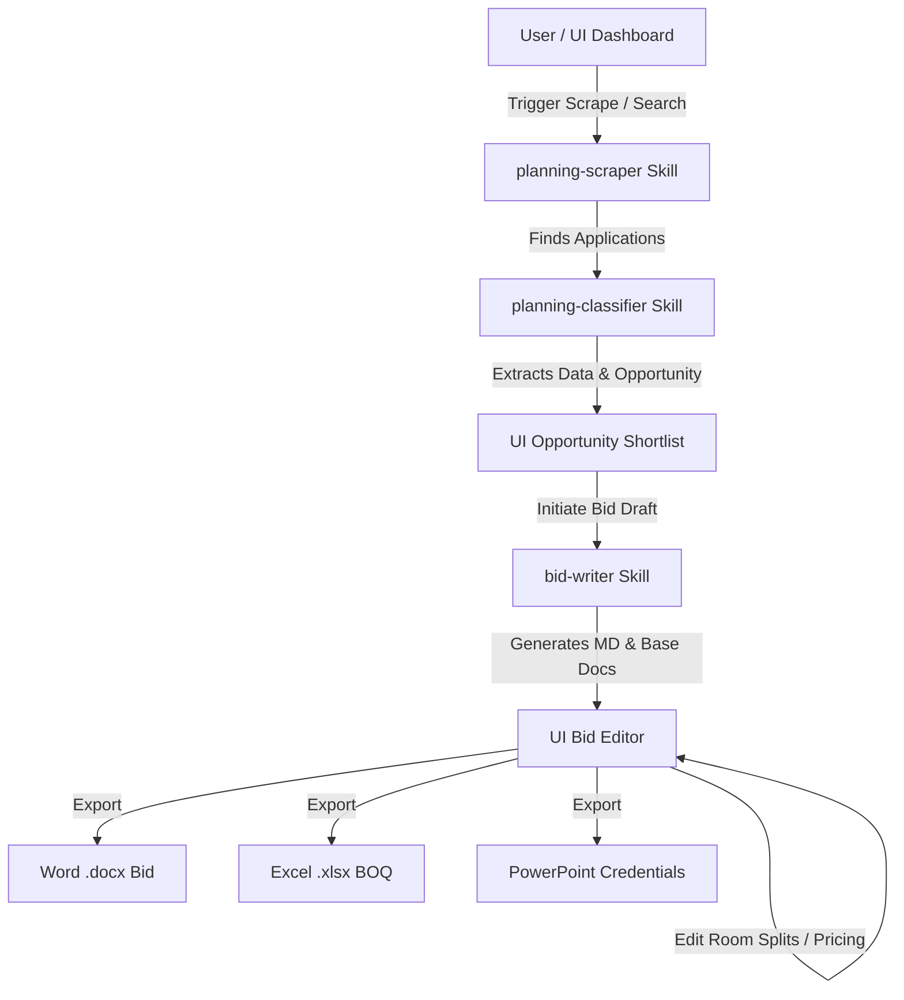

# EzBid — AI-Powered Planning Opportunity Finder & Bid Manager

EzBid is a full-stack platform designed for **Flagstaffe** (an FF&E supply and installation specialist) to automate the discovery of planning applications and streamline the generation of bespoke bid documents.

The project is split between **AI Agents/Skills** (built by Jon to find and analyze planning applications) and a **Dashboard UI** (built to allow users to trigger searches, manage bids in progress, customize pricing, and export files).

---

## Directory Structure & Purpose

The workspace is organized as follows:

*   **[`Jons output/`](file:///c:/Users/netbu/OneDrive/Desktop/Projects/ezbid/Jons%20output)**: Contains sample Word documents (`.docx`) representing output generated by the AI agents for past opportunities (e.g., Heavitree, Southwest Pipeline, Wales Pipeline).
*   **[`Provided Samples/`](file:///c:/Users/netbu/OneDrive/Desktop/Projects/ezbid/Provided%20Samples)**: Real-world reference files showing the standard Flagstaffe pricing formats, client outputs, and company materials:
    *   `Flag22167 - Winvic - Stafford Street...xlsx` (Reference BOQ and pricing sheet)
    *   `Flagstaffe Company Overview.pptx` (Company credentials presentation)
*   **[`bid-writer/`](file:///c:/Users/netbu/OneDrive/Desktop/Projects/ezbid/bid-writer)**: Contains the instruction set and reference material for the AI Agent responsible for drafting the bids:
    *   `SKILL.md`: Detailed step-by-step agent instructions for document generation, styling rules, and math formulas.
    *   `references/firm-profile.md`: Flagstaffe credentials, case studies, employee bios, and fee structures.
    *   `references/bid-template.md`: Section writing guidelines and brand copy.
    *   `references/line-item-rates.md`: Detailed furniture item pricing (110 line items) from the Wolverhampton baseline project.
*   **[`planning-classifier/`](file:///c:/Users/netbu/OneDrive/Desktop/Projects/ezbid/planning-classifier)**: Instructions for the agent that evaluates whether a planning application is a relevant PBSA (student) or co-living scheme.
    *   `SKILL.md`: Step-by-step extraction and classification instructions.
    *   `references/use-classes.md`: Explains UK use classes (Sui Generis, C3, C4).
    *   `references/known-operators.md`: List of major PBSA/co-living operators.
*   **[`planning-scraper/`](file:///c:/Users/netbu/OneDrive/Desktop/Projects/ezbid/planning-scraper)**: Instructions for scanning UK council portals in bulk.
    *   `SKILL.md`: Portal search URLs, regions, and search rotation schedule.
    *   `references/portal-directory.yaml`: Registry of all 366 UK Local Planning Authorities (LPAs) with API/fetch tier metadata.
*   **`frontend/` (Planned)**: React + Vanilla CSS dashboard application for starting searches, managing active bids, and editing pricing.
*   **`backend/` (Planned)**: Node.js/Express.js service to host API endpoints, orchestrate Claude API calls, and compile Markdown data into downloadable Word (`.docx`) and Excel (`.xlsx`) files.

---

## Workspace Collaboration Workflow

1.  **Discovery**: The scraper runs queries across target Local Planning Authority (LPA) portals or reads the news wire.
2.  **Analysis**: The classifier fetches planning application texts and determines if they represent student housing (PBSA) or co-living projects, assessing opportunities and red flags.
3.  **Drafting**: The bid writer combines the planning details with the firm profile to draft the cover letter, services, and past projects.
4.  **Refinement**: The user adjusts bedroom and kitchen counts in the UI to fit the project's exact drawings, instantly recalculating the bill of quantities (BOQ).
5.  **Export**: The backend generates final `.docx` and `.xlsx` files ready for client submission.

---

## Developer Guidelines & Code Quality Standards

To maintain the production-grade integrity of the EzBid platform, any developer or agent contributing to this project must adhere to the following standards:

1. **Senior Engineering Mindset**: Focus on writing clean, modular, self-documenting code with clear separation of concerns. Avoid monolithic functions, hardcoded hacks, and copy-pasted blocks.
2. **Strict Test Coverage (>=90%)**:
   - Every backend API route, database handler, export service, and React page component must be covered by unit/integration tests.
   - Run the unified coverage suite from the root using: `npm run test:coverage`.
   - Keep coverage thresholds strictly above **90%** for statements, branches, functions, and lines.
3. **Older Node Compatibility (v16)**:
   - Ensure the root [`polyfill.js`](file:///c:/Users/netbu/OneDrive/Desktop/Projects/ezbid/polyfill.js) is preloaded when running Vitest or other ESM scripts under older Node environments to ensure `crypto.getRandomValues` resolves correctly.
4. **Mocking Boundaries**:
   - Never hit live external services (like the Anthropic API) or perform destructive file writes on the main `bids.json` data store inside tests. Always isolate integrations using Vitest spies (`vi.mock` / `vi.fn`).

